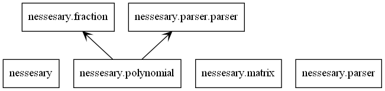

# Calculator for Matrix and Algebra

This is Text-based user interface program that use to solve matrix and algebra problems.

[Link to this git reposityory.](https://github.com/Sosokker/Algebraic-Solving-Tool)

## Table of Content
- [Calculator for Matrix and Algebra](#calculator-for-matrix-and-algebra)
  - [Table of Content](#table-of-content)
  - [Overview](#overview)
  - [Features](#features)
  - [Requirement](#requirement)
  - [Program design](#program-design)
  - [Code structure](#code-structure)
  - [Install and Usage](#install-and-usage)
  - [Guide/Documentation](#guidedocumentation)
    - [Equation](#equation)
    - [Polynomial](#polynomial)
    - [Basic Operation](#basic-operation)
    - [Matrix](#matrix)
  - [Contributing](#contributing)


## Overview

Calculator for Matrix and Algebra can solve some expression that not too complex such as expression that doesn't have much nested parentheses.

It can solve Single Variable Equation and can expand the polynomial.

Some function maybe buggy but If the expression is not contain math function or nested parentheses, It works at its finest. 

## Features

**Calculator for Matrix and Algebra** provide the following function.

- Ability to solve for basic quadratic, cubic and quartic function.
- Calculate operations of Polynomial function e.g. +/-/*/÷/^.
- Calculate operations of Matrix e.g. Inverse/Tranpose/Basic Operation/Determinant.
- Evaluate the expression(No Variable) that has complex parentheses.
- Some basic algebra operation. e.g. Find reduce form of Fraction etc.

## Requirement
This program has been created in **Python 3.10.5** and has the following built-in module.
- [ast](https://docs.python.org/3/library/ast.html) : Abstract Syntax Trees
- [math](https://docs.python.org/3/library/math.html)

## Program design

- This is UML Class Diagram of this program.




## Code structure

**[main.py](main.py)**
 - This file is the main file that read the input and return the result.

**[file_read_write.py](file_read_write.py)**
 - Contains function that use to read and write json file.

**[polynomial.py](nessesary\polynomial.py)**
 - Implement Class Polynomial that contain function to solve, change between array and string form.

**[matrix.py](nessesary\matrix.py)**
 - Implement Class Matrix that contain function to find determiannt, inverse and Tranpose.

**[fraction.py](nessesary\fraction.py)**
 - Implement Class Fraction that contain function to turn float into fraction and can evaluate reduce form.
  
**[parser.py](nessesary\parser\parser.py)**
 - Contain all parsing function such as function that parse string of polynomial to array list.

**[processing.py](nessesary\equation\processing.py)**
 - process the string data inside the program. Use function in this file with polynomial.py to solve the single-variable equation.


## Install and Usage

Clone this repository and run the **main.py**

````
$ git clone https://github.com/Sosokker/Calculator-for-Matrix-and-Algebra
````

## Guide/Documentation

After the running of the **main.py**. You can type the command and input into the terminal that look like this.
````
[1] <- This is line-count.
````
There are two types of command, input style.\
*No need expression command* and *Need expression command.*

>&nbsp;&nbsp;&nbsp;&nbsp;&nbsp;&nbsp;***Command*** 
&nbsp;&nbsp;&nbsp;&nbsp;&nbsp;&nbsp;***or*** 
&nbsp;&nbsp;&nbsp;&nbsp;&nbsp;&nbsp;***Command[expression]***

Whitespace and Case are not matter. Command is same as command.

***Syntax***
|    operator   |  meaning  |   |   |   |
|:-------------:|:---------:|---|---|---|
|       +       |    add    |   |   |   |
|       -       | substract |   |   |   |
| * or adjacant |  multiply |   |   |   |
|       /       |  Division |   |   |   |
|       ^       |   Power   |   |   |   |

For example.
````py
[1] history
# RESULT OF THE INPUT COMMAND
[2] det[[1,2],[3,4]]
# RESULT OF THE INPUT COMMAND
````
Every command you put in and result of it will be save in **history.json** file.

### Equation
&nbsp;&nbsp;&nbsp;&nbsp;**First order** and **Second order** equation can be solved in this program. ⚠️ Other than these type of equaton can't be solved by now⚠️ ***Varible must be x*** ⚠️

- <span style="color:yellow">**solve**[<span style="color:lightblue">equation or expression</span>]</span>
-> equation/expression str

  - This Command use to solve **First order** and **Second order** equation and can use like **poly[expression]** (Next command in this guide).


  ````css
  ===================================
  [1]: solve[-3x^2+2x+1=2x^2-4x+1]
  Input: -3x^2+2x+1=2x^2-4x+1
  ===============================
  Solution to -3x^2+2x+1=2x^2-4x+1
  Answer #1: x = 1.2 | x = 6/5
  Answer #2: x = -0.0 | x = 0
  ===============================

  [2]: solve[-28x^2+0.5x-14.32x^2 = 10+5-4x^3]
  Input: -28x^2+0.5x-14.32x^2=10+5-4x^3
  ===============================================
  Can't find solution to this expression.(Program can only find solution up too 2nd degree polynomial)

  [3]: solve[(2x-1)^2 = 0]
  Input: (2x-1)^2=0
  =========================
  Solution to (2x-1)^2=0
  Answer #1: x = -0.5 | x = -1/2
  =========================
  ````

- <span style="color:yellow">**sim or simplify**[<span style="color:lightblue">expression</span>]</span>
-> equation/expression str

  - This Command use to simplify **First order** and **Second order** equation into expanding form.


  ````css
  [1]: sim[(x-1)^2]   
  Result of Simplify: x^2-2x^1+x^0

  [2]: sim[x-x^2+5x-2x^2+(3x-2)^4]
  Result of Simplify: 81x^4-216x^3+216x^2-96x^1+16x^0

  ````


### Polynomial
&nbsp;&nbsp;&nbsp;&nbsp;Polynomial in this class is store in form of array. This are the following command.
- <span style="color:yellow">Polynomial or poly[<span style="color:lightblue">expression</span>]</span>
-> expression str or list

  - This Command use to print all property of the polynomial that user input. (Answer will be given in both fraction and float form but if answer is complex number Its will be given in floating form only)

⚠️***Warning***⚠️ Can only solve first power equation, quadratic equation.
If enter third, fourth,... degrees equation. Error will occur! ⚠️
(Sorry about this I'didn't implement it yet)

  ````css
  [1]: poly[3x^2-4x-10] 
  Input Polynoimial: 3x^2-4x-10
  ===============================
  Solution to 3x^2-4x-10 = 0
  Answer #1: x = -1.2769839649484336 | x = -798114978092771/625000000000000
  Answer #2: x = 2.610317298281767 | x = 2610317298281767/1000000000000000

  [2]: poly[x+31-x^2] 
  Input Polynoimial: x+31-x^2
  =============================
  Solution to x+31-x^2 = 0
  Answer #1: x = 6.0901699437494745 | x = 12180339887498949/2000000000000000
  Answer #2: x = -5.0901699437494745 | x = -10180339887498949/2000000000000000
  ===============================
````
### Basic Operation
&nbsp;&nbsp;&nbsp;&nbsp;Evaluate operation of Matrix, Polynomial, algebra element.


- <span style="color:yellow">evaluate[<span style="color:lightblue">expression</span>]</span>
-> expression: string(mathematic expression) e.g. evaluate[1+2(5)]

  - Evaluate the operation of expression, Matrix, Polynomial.

  ````css
  [1]: evaluate[1+2(5)]       
  Result: 11
  ````


### Matrix
&nbsp;&nbsp;&nbsp;&nbsp;Matrix in this class store in form of nested list.
- <span style="color:yellow">Matrix[<span style="color:lightblue">expression</span>]</span>
-> expression: nested list

  - This Command use to print all property of the Matrix that user input.

  ````css
  [1]: Matrix[[1,2],[3,4]]
  Input Matrix: Matrix(([1, 2], [3, 4]))
  Determinant: -2
  Tranpose Matrix: Matrix([[1, 3], [2, 4]])
  Inverse Matrix: Matrix([[-2.0, 1.0], [1.5, -0.5]])
  ````

- <span style="color:yellow">**det**[<span style="color:lightblue">expression</span>]</span>
-> expression: nested list

  - This Command use to find determinant of matrix.

  ````css
  [1]: det[[1,2],[3,4]]    
  Determinant: -2
  ````

- <span style="color:yellow">**tranpose**[<span style="color:lightblue">expression</span>]</span>
-> expression: nested list

  - This Command use to find tranpose of matrix.

  ````css
  [1]: det[[1,2],[3,4]]    
  Determinant: -2
  ````

- <span style="color:yellow">**inverse**[<span style="color:lightblue">expression</span>]</span>
-> expression: nested list

  - This Command use to find inverse of matrix.


  ````css
  [1]: det[[1,2],[3,4]]    
  Determinant: -2
  ````
  ⚠️**NOTE**⚠️ Some inverse to nxn matrix when n >= 3 sometimes not that precise. I will try to fix it again.


## Contributing

Pull requests are always welcome and that would be a honor. This first Python project I've dones. I practice using OOP and using github in this work so  many parts of code look a bit messy. 🙈

Thank you so much.


